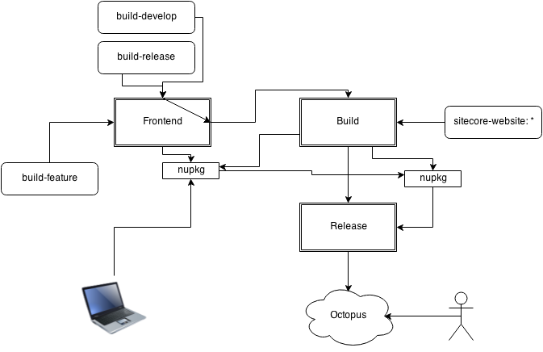

<div class="chapterlogo"></div>
# Dizzy

Dizzy is responsible for the frontend stuff. From package creation to package installation, Dizzy is responsible for the whole lifecycle of the integration of the frontend assets.

The base idea is that, for each version of the frontend assets, a NuGet package is generated, which is then used in a further build step and locally to develop the application.


## How To Use Dizzy in a Sitecore Solution

The first step of integrating Dizzy in a project is to create a Teamcity build configuration with the template *frontend-nuget*. Configure the url of the frontend repository and the name of the NuGet package.

Then install the **Unic.Bob.Dizzy** package in your Website project:

    PM>Install-Package Unic.Bob.Dizzy

After Dizzy is installed you need to configure which NuGet packages are installed. 
Use the `NugetPackages` node in the Bob.config for this: 

```
  <NugetPackages>
    <Package ID="Customer.Frontend" Version="2.5.0-develop0184" />
    <Package ID="Customer.FrontendRWD" Target="assets-rwd" />
  </NugetPackages>
```

The `NugetPackages` node must contain a list of `Package`'s. A package has the following attributes:

| ID | The id of the NuGet package |
| Target | The folder inside the Web-Root where the content of the NuGet package will be extracted. |
| Version | A version pattern to use, to find the correct package. `*` can be used as a wildcard. If a wildcard is used, the latest package will be selected.  | 

To install or update the packages on your local machine, run  `Install-ScNugetPackage`:

    PM>Install-ScNugetPackage

If no version is specified for a package, the version will be detected according to the version of the backend repository:

* develop: Dizzy will try to get a *-develop* package with the same version as the current develop<sup>1)</sup> branch. If there is none the newest *-release* will be used.
* release/\* or hotfix/\*: Newest with *-release*
* feature/\*: Newest with *-develop*

Optionally a parameter can be added to *Install-ScNugetPackage* which specifies which packages should be installed.

	Install-ScNugetPackage Customer.Frontend

You can use it if you only want to update a specific package and not all packages.

<sup>1)</sup> GitVersion is used to detect your local develop version. As GitVersion reads out its informations from your local git repository, you need to have an up to date master-branch as well
as a list of all the tags in your local copy of the git repository. If GitVersion calculates the version on an outdated master branch it may happen that you'll search for and download an old
frontend artefact. 


## Guidelines for Frontend Engineers

Hand out the [Frontender cheat sheet](Cheatsheet.md) to frondend engineers on your project.

## Workflow

<br>
Raw file: [Frontend.xml](assets/Frontend.xml),
Edit with: [https://www.draw.io/](https://www.draw.io/)

Each build of the frontend must be pushed back to a build-\* branch. On Teamcity there is a build configuration *Frontend* with a build trigger for the build-\* branches.

The *Frontend* build configuration creates a NuGet package containing the assets. If the build was pushed to build-develop or build-release the *Build* build configuration will be triggered. The *Build* configuration creates a \*.Website NuGet package which contains our code and the frontend assets.

## Versioning

The versioning of the frontend package is done with the following scheme.
* build-release
```
    Major.Minor.Patch-release%build.counter.padded%
```
*  build-develop
```
    Major.Minor.Patch-beta%build.counter.padded%
```
* build-feature
```
    Major.Minor.Patch-FeatureBranchName%build.counter.padded%
```
